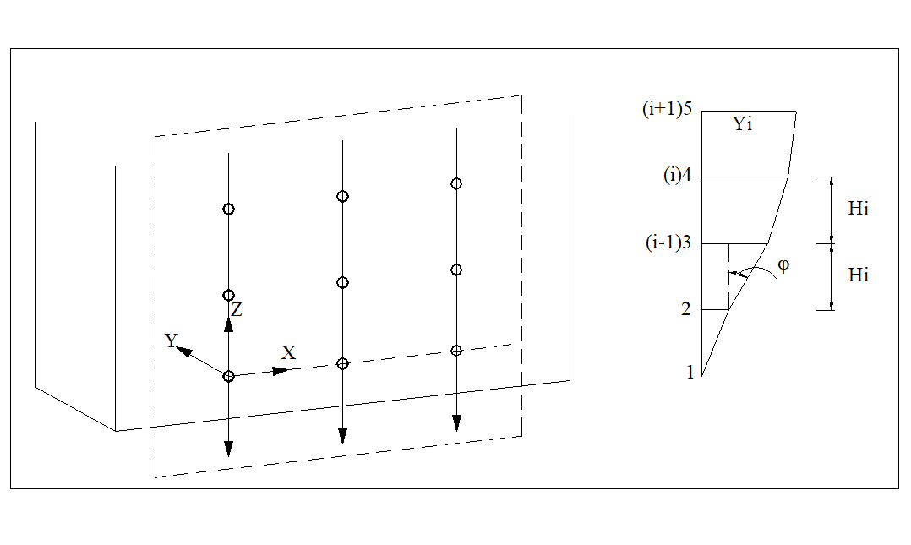

```{r setup, include=FALSE}
knitr::opts_chunk$set(echo = FALSE, warning = FALSE, message = FALSE)
library(captioner) # handle figures and tables numbering

# Declare variables for figures and table counting
fig_nums <- captioner::captioner()
table_nums <- captioner::captioner(prefix = "Table")
```


# MANUSCRIPT


## General Instructions

The paper should have the following structure:

1.  Title of the paper
2.  Authors and affiliation, rendered **anonymous**
3.  Keywords (6--8 words)
4.  Abstract (100--250 words)
5.  Introduction
6.  Main body
7.  Conclusions
8.  Acknowledgements, rendered **anonymous**
9.  References
10. Appendix (if applicable)

Full papers **submitted for double-blind review** must not contain any
information which makes it possible to identify the authors. In
particular, names and affiliations must be removed from the manuscript
submitted for review. Also sentences such as "As we have shown in
previous work (Author\_x, 20xx)" are to be avoided. Instead use a
formulation such as "Author\_x (20xx) has shown \...". Note that
submissions which have not been appropriately anonymised may be subject
to immediate rejection.\
In case, the contribution has been accepted for publication, a
camera-ready manuscript must be submitted at the due date. In this
camera-ready manuscript the name(s) and affiliation(s) of the authors(s)
must be identified, and acknowledgements can be personalized.

## Page Layout, Spacing and Margins

The paper must be compiled in one column for the Title and Abstract and
in two columns for all subsequent text. All text should be
single-spaced, unless otherwise stated. Left and right justified typing
is preferred.

## Preparation in electronic form

To assist authors in preparing their contributions, styleguides are
provided in Word and/or LaTeX on the ISPRS web Page, see:
http://www.isprs.org/documents/orangebook/app5.aspx.

## Length and Font

All manuscripts, except Invited Papers are limited to a length of
approximately eight (8) single-spaced pages (A4 size), including
abstracts, figures, tables and references. ISPRS Invited Papers are
limited to approximately twelve (12) pages. In any case, the minimum
length is six (6) pages. The font type Times New Roman with a size of
nine (9) points is to be used.


```{r settingd-tibble, results="hide"}
settings <- tibble::tribble(
          ~Setting, ~mm, ~inches,
             "Top", 25L,       1,
          "Bottom", 25L,       1,
            "Left", 20L,     0.8,
           "Right", 20L,     0.8,
    "Column Width", 82L,     3.2,
  "Column Spacing",  6L,    0.25
  )
caption <- "Margin settings for A4 size page."
table_nums(name = "table1", caption = caption)
```


```{r display-settings}
knitr::kable(x = settings, 
             format = "html", 
             align = "lcc")
```

`r paste0('<p class="caption">',table_nums("table1"), '</p>')`

# TITLE AND ABSTRACT BLOCK

## Title

The title should appear centred in bold capital letters, at the top of
the first page of the paper with a size of twelve (12) points and
single-spacing. Author(s) name(s), affiliation and mailing address
should be masked. They will only appear in the final version if the
paper is accepted either in the ISPRS Annals or Archives.

## ISPRS Affiliation (optional)

For those authors affiliated with a specific Commission and/or Working
Group of ISPRS, a separate title may be entered. The title should be
centred in bold type after one blank line below the author's
affiliation, i.e. Commission \#, Working Group \#. The Commission number
shall be Roman and the Working Group number should be the Commission
Roman number, slash, WG Arabic number (see example above).

## Key Words

Leave two lines blank, then type **"KEY WORDS:"** in bold capital
letters, followed by 5--8 key words. Note that ISPRS does not provide a
set list of key words any longer. Therefore, include those key words
which you would use to find a paper with content you are preparing.

## Abstract

Leave two blank lines under the key words. Type **"ABSTRACT:"** flush
left in bold Capitals followed by one blank line. Start now with a
concise Abstract (100--250 words) which presents briefly the content and
very importantly, the news and results of the paper in words
understandable also to non-specialists.

# MAIN BODY OF TEXT

Type text single-spaced, **with** one blank line between paragraphs and
following headings. Start paragraphs flush with left margin.

## Headings

Major headings are to be centred, in bold capitals without underlining,
after two blank lines and followed by a one blank line.

Type subheadings flush with the left margin in bold upper case and lower
case letters. Subheadings are on a separate line between two single
blank lines.

Subsubheadings are to be typed in bold upper case and lower case letters
after one blank line flush with the left margin of the page, with text
following on the same line. Subsubheadings may be followed by a period
or colon, they may also be the first word of the paragraph's sentence.

Use decimal numbering for headings and subheadings.

## Footnotes

Mark footnotes in the text with a number (1); use consecutive numbers
for following footnotes. Place footnotes at the bottom of the page,
separated from the text above it by a horizontal line.

## Illustrations and Tables

### Placement: {-}

Figures must be placed in the appropriate location in the document, as
close as practicable to the reference of the figure in the text. While
figures and tables are usually aligned horizontally on the page, large
figures and tables sometimes need to be turned on their sides. If you
must turn a figure or table sideways, please be sure that the top is
always on the left-hand side of the page.

### Captions:

All captions should be typed in upper and lower case letters, centred
directly beneath the illustration. Use single spacing if they use more
than one line. All captions are to be numbered consecutively, e.g.
Figure 1, Figure 2, Figure 3, .. and Table 1, Table 2, Table 3, \...

```{r, results='hide'}
caption <- "Figure placement and numbering."
fig_nums(name = "fig1", caption = caption)
```

```{r fig1, eval=TRUE}

```

`r paste0('<p class="caption">',fig_nums("fig1"), '</p>')`


### Copyright

If your article contains any copyrighted illustrations or imagery,
please include a statement of copyright such as: © SPOT Image Copyright
20xx (fill in year), CNES. It is the author's responsibility to obtain
any necessary copyright permission. After publication, your article is
distributed under [the Creative Commons Unported License]{.underline}
and you retain the copyright.

## Equations, Symbols and Units
### Equations:

Equations should be numbered consecutively throughout the contribution.
The equation number is enclosed in parentheses and placed flush right.
Leave one blank lines before and after equations:

$$\label{equ:1}
    x = x_0 -c \frac{X - X_0}{Z - Z_0}; y = y_0 -c \frac{Y - Y_0}{Z - Z_0},$$

<!-- Tabbing not working properly-->
where   $c$ = principle distance  
  $x,y$ = image coordinates  
  $X_0,Y_0, Z_0$ = coordinates of projection centre  
  $X, Y, Z$ = object coordinates
  
### Symbols and Units:

Use the SI (Système International) Units and Symbols. Unusual characters
or symbols should be explained in a list of nomenclature.

## References

References should be cited in the text, thus [@smith1987rep], and listed
in alphabetical order in the reference section. The following
arrangements should be used:

### References from Journals:

Journals should be cited like [@smith1987] or [@michalis2008]. Names of
journals can be abbreviated according to the "International List of
Periodical Title Word Abbreviations". In case of doubt, write names in
full.

### References from Books:

Books should be cited like [@foerstner2016].

### References from other Literature:

Other literature should be cited like [@smith1987rep] and [@smith2000].

### References from Websites:

References from the internet should be cited like [@chan2017]
and [@maas2017]. Use ofpersistent identifiers such as the Digital Object
Identifier (DOI) rather than URLs is strongly advised. In this case last
date of visiting the website can be omitted, as the identifier will not
change.

### References from Research Data:

References from research data should be cited like [@dubayah2013].

### References from Software Projects:

References to a software project as a high level container including
multiple versions of the software should be cited like [@grass2017].

### References from Software Versions:

References to a specific software version should be cited
like [@grass2015].

### References from Software Project Add-ons:

References to a specific software add-on to a software project should be
cited like [@lennert2017].

### References from Software Repository:

References from software repositories should be cited like [@gago2016].

# ACKNOWLEDGEMENTS (Optional) {-}

Acknowledgements of support for the project/paper/author are welcome if
they do not violate the anonymity of the submitted paper. Otherwise,
they should be masked.

# REFERENCES {-}
::: {#refs}
:::

# APPENDIX (Optional) {-}

Any additional supporting data may be appended, provided the paper does
not exceed the limits given above.

```{js, echo=FALSE}
// insert a soft break to avoid an infinite loop with FF
// this is because FF handles lists differently
document.querySelector('#TOC h1').insertAdjacentHTML('afterend', '<wbr>');
```
